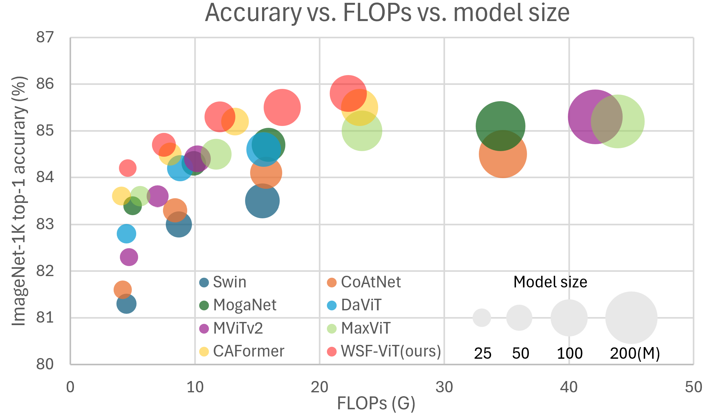
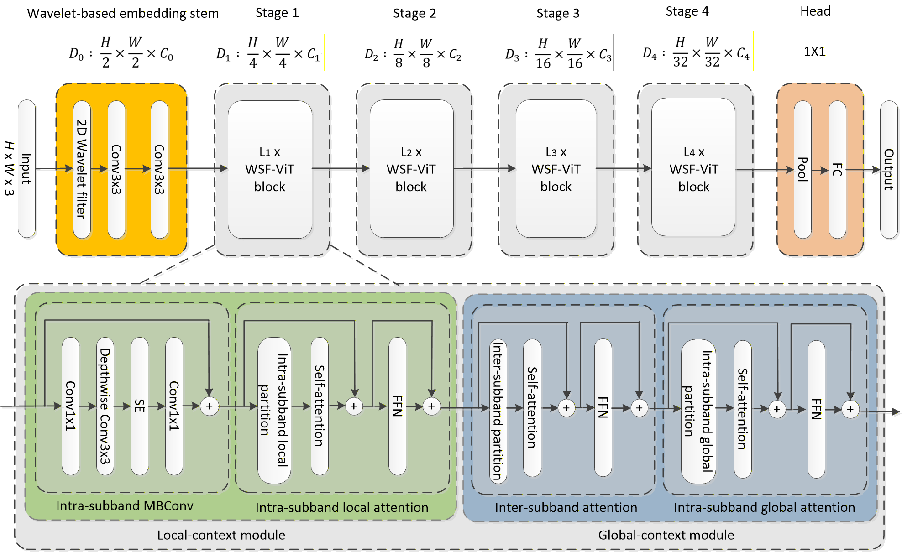
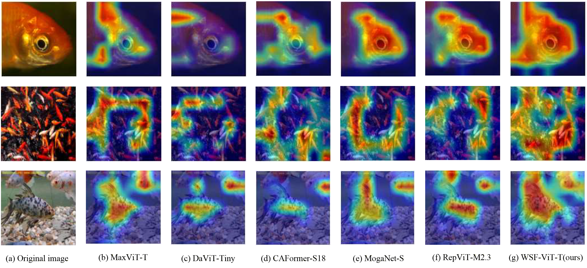

# WSF‑ViT: Wavelet‑Based Spatial‑Frequency Attention for Vision Transformers


While recent vision transformers operating purely in the spatial domain have achieved high performance in capturing localized patterns, their reliance on fixed attention windows often limits effective modeling of global contextual dependencies. To address this limitation, we propose WSF-ViT, a vision transformer with a wavelet-based spatial–frequency attention framework. The proposed wavelet embedding stem decomposes input images into multi-frequency subbands, and the WSF attention blocks jointly model intra- and inter-subband interactions, enabling effective integration of fine-grained spatial details and global semantic information across frequency domains. Experimental results on the ImageNet-1K classification benchmark show that WSF-ViT achieves 85.8\% top-1 accuracy with 100M parameters and 22.3G FLOPs when trained from scratch, establishing state-of-the-art performance among vision transformers with comparable model complexity. 



## Requirements

```
pip install -r requirements.txt
```

## Results

### ImageNet-1K Trained Models

|   Model    | Resolution | Params (M) | Flops (G) | Top-1 Acc | Download |
| :--------: | :--------: | :--------: | :-------: | :-------: | :------: |
| WSF-ViT-P0 |   224x224  |     2.9    |    0.62   |   76.2%   | |
| WSF-ViT-P1 |   224x224  |     5.0    |    1.04   |   79.4%   | [here](https://drive.google.com/file/d/1qy1fOaXMjIBR1brwZ39x26c7H9hWdKAl/view?usp=sharing) |
| WSF-ViT-P2 |   224x224  |     6.0    |    1.35   |   80.8%   | [here](https://drive.google.com/file/d/1O11PYA3KVq-k9loP1DOGmZH0hta3bRdc/view?usp=sharing)    |
| WSF-ViT-N  |   224x224  |    10.6    |    1.97   |   82.2%   | [here](https://drive.google.com/file/d/12B2cATh5tiPz6Oh1Ww3ozv6Cf3ApDyCo/view?usp=sharing)    |
| WSF-ViT-T  |   224x224  |    23.3    |    4.6    |   84.2%   | [here](https://drive.google.com/file/d/1i5XdYL0hav53-Avq3pzkEyuuL3QwpcLm/view?usp=sharing) |
| WSF-ViT-S  |   224x224  |    41.7    |    7.5    |   84.7%   | [here](https://drive.google.com/file/d/1H7jGSuBTLOiKPABwzq1VtEq_OPovnhYj/view?usp=sharing) |
| WSF-ViT-M  |   224x224  |    69.7    |   12.4    |   85.3%   | [here](https://drive.google.com/file/d/1y9LDTL8anAEqVBqnZvFaJMtOw3z8LRpz/view?usp=sharing) |
| WSF-ViT-B  |   224x224  |   100.0    |   17.0    |   85.5%   | [here](https://drive.google.com/file/d/1bhsWi7GpP1p7off83FOPFi8_492EbzT3/view?usp=sharing)    |
| WSF-ViT-B  |   256x256  |   100.0    |   22.2    |   85.8%   | [here](https://drive.google.com/file/d/1sGRFU1SAVIvcyCR0-7io1spqUQe5lUGq/view?usp=sharing)    |

### ImageNet-1k FineTuned
|   Model    | Resolution | Params (M) | Flops (G) | Top-1 Acc | Download |
| :--------: | :--------: | :--------: | :-------: | :-------: | :------: |
| WSF-ViT-T  |   384x384  |    23.3    |   14.1    |   85.3%   | [here](https://drive.google.com/file/d/13uOPDiZBRvKQ8Wqtxv6x9o_Qq8usG4aN/view?usp=sharing)    |
| WSF-ViT-S  |   384x384  |    41.8    |   22.9    |   85.8%   | [here](https://drive.google.com/file/d/1nBiqod8RU3ru7XL4CYF-AVuW0Agjc3i5/view?usp=sharing) |
| WSF-ViT-M  |   384x384  |    69.7    |   37.8    |   86.2%   | [here](https://drive.google.com/file/d/1XC7FJmMY4nNF-_4lu7CpG_WqHMPyqVGW/view?usp=sharing) |
| WSF-ViT-B  |   384x384  |   100.0    |   51.7    |   86.3%   | [here](https://drive.google.com/file/d/1bZCufXSoQIChbCCo4W9ZAmfMOT3cx3z9/view?usp=sharing) |

### Train
The code to train MixViT on ImageNet-1k.
```shell
bash ./scripts/wsfvit_t_224_1k.sh /path/to/imagenet-1k num_gpus
```

### Anaylysis 
The code to validate accuracy of WSF-ViT.
```shell
python validate.py /path/to/imagenet-1k --model wsfvit_t_224 --checkpoint /path/to/checkpoint --img-size 224
```

The code to count params and flops of WSF-ViT variants
```shell
python get_flops.py --model wsfvit_t_224  --img-size 224
```

The code to visuallize Grad-CAM activation maps
```shell
python cam_image.py --data-dir ./images --checkpoint /path/to/checkpoint
```


### Object Detection
|   Method   | Backbone  |   Pretrain  | Resolution | Params | FLOPS  | Lr schd | box mAP | AP50 | AP75 | mask mAP | AP50 | AP75 | Download |
| :--------: | :-------: | :---------: | :--------: | :----: | :----: | :-----: | :-----: | :--: | :--: | :------: | :--: | :--: | :------: |
| Mask R-CNN | WSF-ViT-T | ImageNet-1K | 1120 x 896 |  42.7M | 254.6G |  MS 3x  |   48.6  | 70.6 | 53.6 |   43.7   | 67.6 | 47.2 | [here](https://drive.google.com/file/d/1h0E4pVdz3QOiT_5eg46FPd5kc7Yr3NBt/view?usp=drive_link) |

|       Method       | Backbone  |   Pretrain  | Resolution | Params | FLOPS |  Lr schd   | box mAP | AP50 | AP75 | mask mAP | AP50 | AP75 | Download |
| :----------------: | :-------: | :---------: | :--------: | :----: | :---: | :--------: | :-----: | :--: | :--: | :------: | :--: | :--: | :------: |
| Cascade Mask R-CNN | WSF-ViT-T | ImageNet-1K | 1120 x 896 |  80.5M |  733G | GIOU+MS 3x |  52.3   | 71.1 | 56.6 |  45.2    | 68.4 | 49.0 | [here](https://drive.google.com/file/d/1XS2FZre0QcdbC4teWoDZBt9IDOvBjJfu/view?usp=drive_link) |
| Cascade Mask R-CNN | WSF-ViT-S | ImageNet-1K | 1120 x 896 |  98.9M |  788G | GIOU+MS 3x |  53.2   | 72.2 | 57.9 |  46.0    | 69.6 | 49.9 | [here](https://drive.google.com/file/d/1QvN5exdoPUH-aseNuf2oBudX5RbbKWrs/view?usp=drive_link) |
| Cascade Mask R-CNN | WSF-ViT-M | ImageNet-1K | 1120 x 896 | 126.7M |  885G | GIOU+MS 3x |  53.6   | 72.4 | 58.2 |  46.4    | 69.8 | 50.5 | [here](https://drive.google.com/file/d/1521Uu4TtgDfMaVdH2cIEtya_8L0Xu0YS/view?usp=drive_link) |


### Video Prediction on Moving MNIST
| Architecture |   Setting  | Params | FLOPs |  MSE  |  MAE  |  SSIM  |  PSNR | Download |
| :----------: | :--------: | :----: | :---: | :---: | :---: | :----: | :---: | :------: |
|   WSF-ViT    |  200 epoch |  37.6M | 14.0G | 25.68 | 75.59 | 0.9317 | 38.38 | [here](https://drive.google.com/file/d/1yAO4uUK1H9ir9BuR3GYb3roiuz2RZr54/view?usp=drive_link) |
|   WSF-ViT    | 2000 epoch |  37.6M | 14.0G | 16.37 | 53.57 | 0.9579 | 39.26 | [here](https://drive.google.com/file/d/1TZyKG5IfOzNArwJy6GJwdILiHZxSY0fW/view?usp=drive_link) |


## Contributing
- [pytorch-image-models (timm)](https://github.com/huggingface/pytorch-image-models)
- [MaxViT](https://github.com/google-research/maxvit)
- [MogaNet](https://github.com/Westlake-AI/MogaNet) 
- [MMDetection](https://github.com/open-mmlab/mmdetection)
- [OpenSTL](https://github.com/chengtan9907/OpenSTL)
